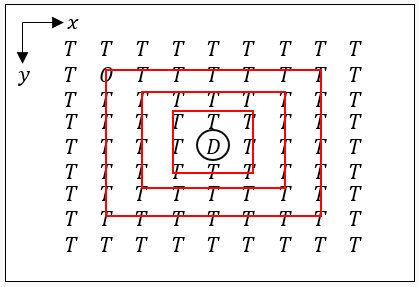

# Drone theater of operations

    This project simulates the interaction beetwen drones and targets in a theater.
    Basically, you could send drones in some coordenate (x, y) that explodes with 
    a rectangular radius r and with an explotion power p.
    Later, you can set targets in the theater which could be of two differents types, 
    OM (Military Targets) and IC (Civil Structure) in a coordenate pair (x,y) with 
    certain resistance r.
    The program will calculate the final health of all targets in the theater, 
    and will printf a summary of how many targets were destroyed, how many were partially
    destroyed, and how many are still intact.

## Characteristics

    -   It has two differents strategies to solve the problem:
            1.  Calculates how each dron affect each target. The program would check for each
                dron D and each target T if the dron D is able to reach target T; in that case,
                it would update the health of target T.
                Complexity: Let d be the amount of drones and t be the amount of targets, 
                then the iterations made in this strategy would be:
                                                d * o
                Important: There are optimizations in the middle, so this is the promedy case,
                sometimes it could be better than this.

            2.  Checks each box affected by each drone, it goes through all the boxes affected
                by a drone D and checks if some target is there, in that case, it would update
                target's health.
                Complexity: Let d be the amount of drones, since the amount of boxes affected 
                by a drone is (2r + 1)², r being the radius, then the complexity would be:
                            (2*r1 + 1)² + (2*r2 + 1)² + ... + (2*rn + 1)²

                Important: There are optimizations in the middle, so this is the promedy case,
                sometimes it could be better than this.

                

    -   The program would calculate (d * o) and ((2*r1 + 1)² + (2*r2 + 1)² + ... + (2*rn + 1)²)
        to determine what strategy is better for the problem given.
    
    -   The program is designed to solve the problem given usign threads and also using processes,
        in order to acelerate time execution and taking advantage of CPU's power.

        Thread solution execution:

            1.  Go to folder "teopHilos".
            2.  Execute the command "make".
            3.  Prepare an input file with the specified format and with termination .txt and
                save it in the folder "teopProcesos".
            3.  Execute the command "./teoph n 'filename.txt'" where n is the amount of threads 
                to be used.

        Thread solution execution:

            1.  Go to folder "teopProcesos".
            2.  Execute the command "make".
            3.  Prepare an input file with the specified format and with termination .txt and 
                save it in the folder "teopProcesos".
            3.  Execute the command "./teopp n 'filename.txt'" where n is the amount of processes 
                to be used.

## Problems found

    -   When the input is very small, the CPU planner could decide not to use more than one core
        to execute the program letting all threads in just one core, so an iterative version 
        will be better than the thread version. 

[GIF](https://media4.giphy.com/media/v1.Y2lkPTc5MGI3NjExOXRpZjIwNXFqYXg4bXF5YXB1ajRvMmNpNHh4anA5ZTRkdHRoM3d5diZlcD12MV9pbnRlcm5hbF9naWZfYnlfaWQmY3Q9Zw/Ph0oIVQeuvh0k/giphy.gif)
